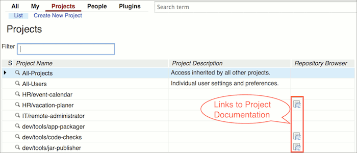
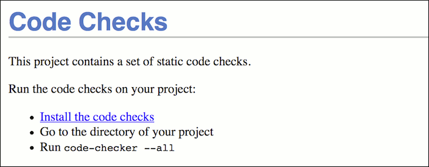
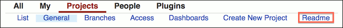
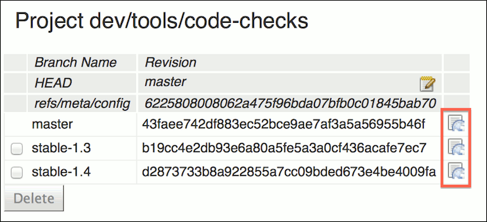
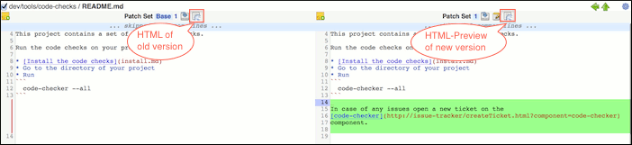

User Guide
==========

The @PLUGIN@ plugin serves [Markdown](http://daringfireball.net/projects/markdown/)
project documentation as HTML pages.

The entry point to the project documentation is a `README.md` file in
the root directory of a project.

If a project has a `README.md` file in its root directory then a link
to the project documentation is displayed for it in the
[project list](@URL@#/admin/projects/).



Clicking on the documentation icon opens the rendered HTML of the
`README.md` file in a new tab.



If a project is selected the project documentation is also available
from the `Projects` menu.



The documentation is served from the tip of the default branch.
The documentation for other branches is available from the project
branches screen.



When reviewing documentation changes a preview of the rendered HTML is
available for Markdown files. This allows to detect any formatting
issues quickly. The preview is available from the side-by-side diff
view and it is opened in a new tab.



The URL scheme of the plugin allows to access the HTML of all Markdown
file in the project from any revision (branch or commit). The project
name, the revision and the file name must be URL encoded.

```
  /@PLUGIN@/project/<project>/rev/<revision>/<file>.md
```

E.g.:

```
  /@PLUGIN@/project/dev%2Ftools%2Fcode-checks/rev/stable-1.3/docs%2Ffaq.md
```

A Markdown file can contain links to other Markdown files which are
contained in the project.

```
  The installation is described in the [installation guide](install-guide.md).
```

Images that are stored in the project can be included into the Markdown
documentation, but they are only rendered if the image mimetype is
configured on the Gerrit server as a
[safe mimetype](../../../Documentation/config-gerrit.html#mimetype).

```
  
```

Inline HTML blocks as well as inline HTML tags are suppressed. Both
will be accepted in the input but not be contained in the output.

Markdown files may include the following macros which are automatically
replaced when the HTML pages are generated.

* `\@URL@`: The web URL of the Gerrit server.
